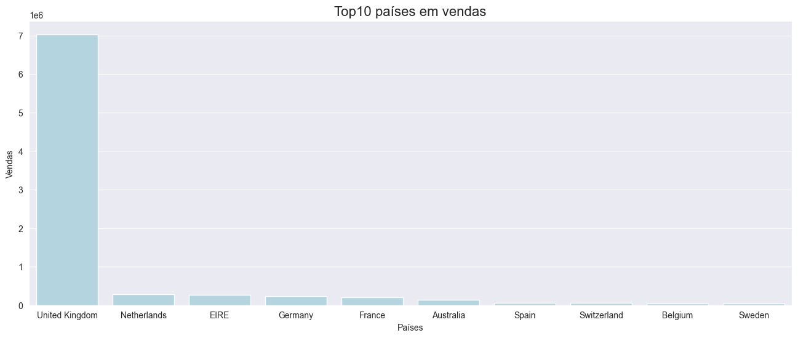
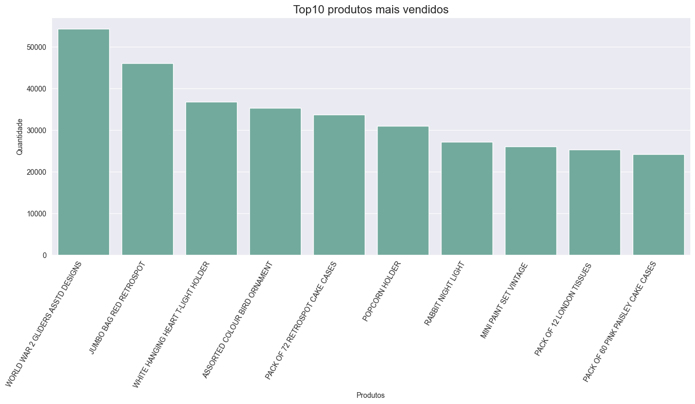
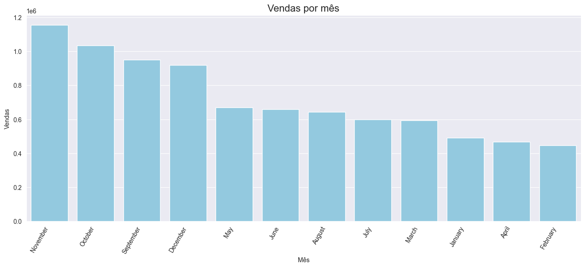
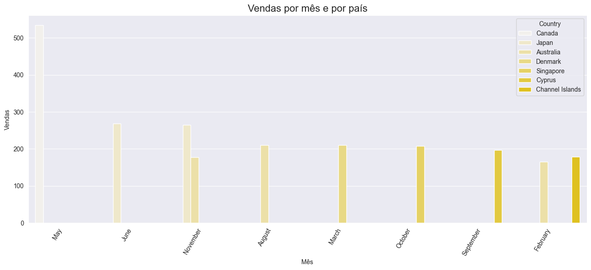

# Case - Preparando um dataset para o cálculo de indicadores RFM de uma empresa de e-commerce

## Introdução

Uma empresa do ramo de e-commerce tem uma base de dados contendo diversas informações dos seus clientes ao redor do mundo. Fazendo uma análise criteriosa, esta deseja levantar os indicadores RFM destes clientes, sendo RFM definido por:

- R (Recency): Tempo que o cliente realizou a última compra (em dias)
- F (Frequency): Quantidade de compras realizadas pelo cliente
- M (Monetary): Valor do ticket médio gasto pelo cliente. Onde ticket médio = média do total gasto por pedido para cada cliente.

Além disso, necessita também de gráficos contendo informações valiosas de valores de venda por país, por produto e por mês.

## Objetivo do projeto

A partir da base de dados disponibilizada pela empresa, gerar um output em csv contendo apenas a identificação dos clientes e as métricas RFM calculadas. E, plotar os seguintes gráficos solicitados:

- Top 10 países com maior valor em vendas;
- Top 10 produtos mais vendidos;
- Valor de venda total por mês;
- Valor de venda total por mês e por país (considerando apenas o top 10).

## Sobre os dados

A tabela contém informações de compras de um e-commerce em 37 países. Contém a identificação do cliente e os dados da compra.

- CustomerID = Código de identificação do cliente;
- Description = Descrição do produto;
- InvoiceNo = Código da fatura;
- StockCode = Código de estoque do produto;
- Quantity = Quantidade do produto;
- InvoiceDate = Data do faturamento (compra);
- UnitPrice = Preço unitário do produto;
- Country = País da compra.

## Bibliotecas utilizadas no desenvolvimento do projeto

Segue uma lista com as bibliotecas utilizadas no desenvolvimento e resolução deste case
- Pandas
- Numpy
- Matplotlib
- Seaborn
- Missingno
- Sklearn

## Deployment

Para executar o projeto é necessário baixar o arquivo "case_analise_rfm.ipynb" (código do projeto) e o database "data.csv". Feito isso, salvar ambos os arquivos na mesma pasta e executar o código utilizando programas de visualização e leituras de códigos em jupyter notebook, como Visual Studio Code por exemplo, ou algum outro software similar.

Obs: para executar o código corretamente as bibliotecas listadas na sessão anterior precisam estar instaladas em sua máquina.

## Resultados

### Gráficos

#### Top 10 países com maiores valores em vendas

#### Top 10 produtos mais vendidos

#### Valor de venda total por mês

#### Valor de venda total por mês e por país

### RFM

Segue abaixo um resumo da tabela com os resultados de cada um dos indicadores RFM por CustomerID. Para acessar a tabela completa, basta baixar o arquivo "customer_rfm.csv" que se encontra na lista de arquivos deste repositório.
 

<table border="1" class="dataframe">
  <thead>
    <tr style="text-align: right;">
      <th></th>
      <th>Frequency</th>
      <th>Monetary</th>
      <th>Recency</th>
    </tr>
    <tr>
      <th>CustomerID</th>
      <th></th>
      <th></th>
      <th></th>
    </tr>
  </thead>
  <tbody>
    <tr>
      <th>12347</th>
      <td>7</td>
      <td>23.681319</td>
      <td>1</td>
    </tr>
    <tr>
      <th>12348</th>
      <td>4</td>
      <td>57.975484</td>
      <td>74</td>
    </tr>
    <tr>
      <th>12349</th>
      <td>1</td>
      <td>24.076027</td>
      <td>18</td>
    </tr>
    <tr>
      <th>12350</th>
      <td>1</td>
      <td>19.670588</td>
      <td>309</td>
    </tr>
    <tr>
      <th>12352</th>
      <td>8</td>
      <td>29.482824</td>
      <td>35</td>
    </tr>
    <tr>
      <th>...</th>
      <td>...</td>
      <td>...</td>
      <td>...</td>
    </tr>
    <tr>
      <th>18280</th>
      <td>1</td>
      <td>18.060000</td>
      <td>277</td>
    </tr>
    <tr>
      <th>18281</th>
      <td>1</td>
      <td>11.545714</td>
      <td>180</td>
    </tr>
    <tr>
      <th>18282</th>
      <td>2</td>
      <td>14.837500</td>
      <td>7</td>
    </tr>
    <tr>
      <th>18283</th>
      <td>16</td>
      <td>2.837074</td>
      <td>3</td>
    </tr>
    <tr>
      <th>18287</th>
      <td>3</td>
      <td>26.246857</td>
      <td>42</td>
    </tr>
  </tbody>
</table>

4337 rows × 3 columns

